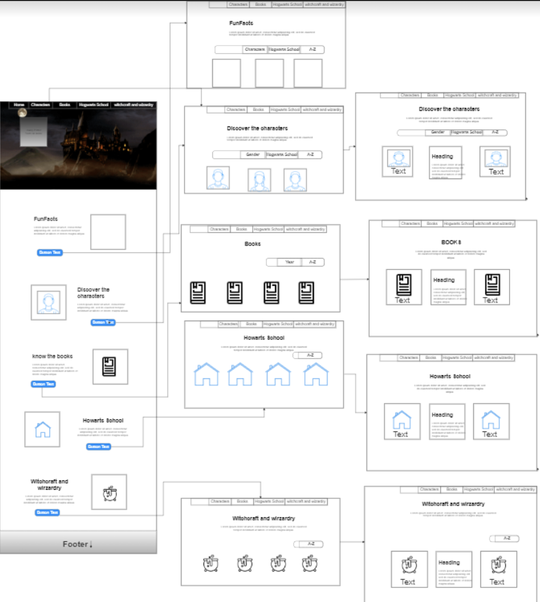

# Harry Potter

## Índice

* [1. Link proyecto](#1-Link)
* [2. Resumen del proyecto](#2-resumen-del-proyecto)
* [3. Investigación UX](#3-investigación-UX)
* [4. Historias de Usuario](#4-historias-de-usuario)
* [5. Diseño de la Interfaz de Usuario](#5-diseño-de-la-interfaz-de-usuario)
* [6. Testeos de usabilidad](#6-testeos-de-usabilidad)
* [7. Pruebas unitarias](#7-pruebas-unitarias)

***

## 1. Link Proyecto

[Link](https://www.forbes.com/sites/bernardmarr/2018/05/21/how-much-data-do-we-create-every-day-the-mind-blowing-stats-everyone-should-read),

## 2. Resumen del proyecto

## 3. Investigación UX

¿Quiénes son los principales usuarios del producto?

Fans principiantes o usuarios principiantes, que quieran conocer más sobre los personajes de la saga, hechizos, libros, pociones o algún dato curioso sobre Harry Potter, también personas que necesiten realizar algún tipo de investigación acerca de la temática.

¿Cuáles son los objetivos de estos usuarios en relación con el producto?

Conocer más acerca de personajes que aparecen en la saga, ya que se podrá encontrar información básica como nombre, especie, género, fecha de nacimiento, casa de estudio, saber si es un ser mágico o muggle, grupos a los que pertenece, libros en los que aparece entre otras cosas como pociones, hechizos y datos curiosos.

¿Cuáles son los datos más relevantes que quieren ver en la interfaz y por qué?

Se espera visualizar personajes, todos los libros escritos por J.K Rowling e información detallada de cada uno, su año de lanzamiento, personajes, las casas: Gryffindor, Hufflepuff, Ravenclaw y Slytherin y mucho más.

¿Cuándo utilizan o utilizarían el producto?

En los tiempos libres para distraerse, compartir con familiares y amigos.  También para personas que necesiten realizar algún trabajo o presentaciones que contengan esta temática y necesiten de esta información.

## 4. Historias de Usuario

## 5. Diseño de la Interfaz de Usuario

### Prototipo de baja fidelidad

### Prototipo de alta fidelidad

## 6. Testeos de usabilidad

*
*
*

## 7. Pruebas unitarias

